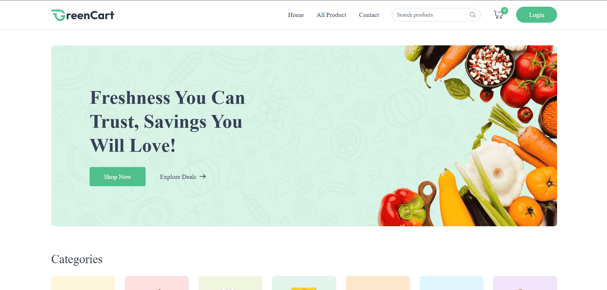
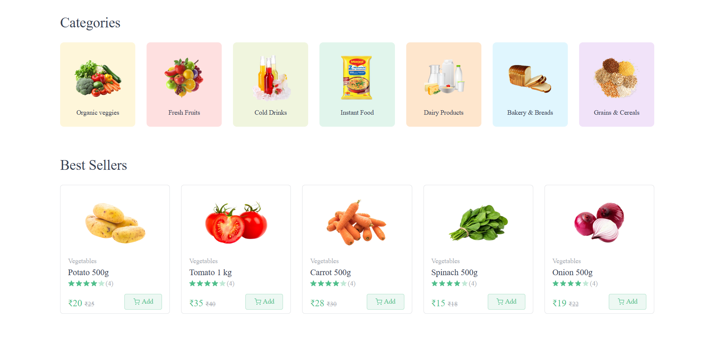
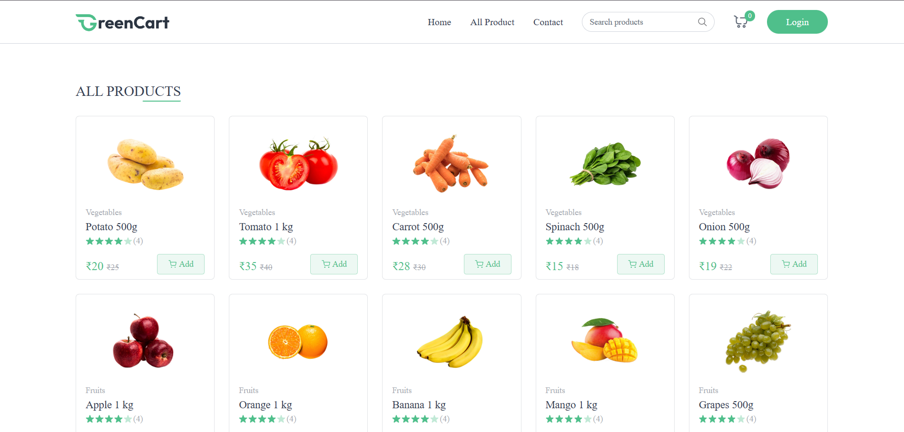

# 🥬 GreenCart – Grocery Shopping Web Application

GreenCart is a modern **frontend-only grocery shopping web application** that allows users to browse products, view categories, manage a shopping cart, and simulate order placement. The project focuses on building a clean UI, smooth user experience, and frontend state management using React.

---

## 🚀 Features

### 🛒 Product Browsing
- Browse grocery products by category
- View product details with images
- Responsive product cards

### 🧺 Shopping Cart
- Add and remove items from cart
- Update item quantity
- Real-time cart price calculation
- Tax and total amount calculation

### 🎨 Modern UI
- Clean and responsive design
- Reusable React components
- Optimized layout for desktop and mobile

### ⚡ Frontend State Management
- Centralized state using React Context API
- Cart state management without backend dependency
- Static product data with local image assets

---

## 🛠️ Tech Stack

### **Frontend**
- React
- Vite
- Axios
- Clerk Authentication
- Vercel Deployment

### **Backend**
- Node.js
- Express
- MongoDB / Mongoose
- Cloudinary
- Render Deployment

---

## 🌐 Deployment Links

- Live deployment link: https://green-cart-zeta.vercel.app/

---

## 🔧 Installation

### 1️⃣ Clone the repository
git clone https://github.com/Ridhi247/GreenCart
cd GreenCart

### 2️⃣ Install frontend dependencies
cd client
npm install

---

## ▶️ Run Locally

## Frontend
cd client
npm run dev

---

## 🧠 Challenges Faced
- Integrating Clerk authentication with backend
- Setting up environment variables on Vercel and Render
- Solving CORS issues between frontend and backend
- Handling Cloudinary multi-image uploads
- Fixing GitHub and Vercel deployment configuration issues

---

## 📚 Learnings

- Full-stack deployment workflow
- Token-based authentication
- Cloudinary image handling
- Environment variable security
- Debugging real API issues

---

## 🤝 Contributing
Contributions and suggestions are welcome.

---

## 📸 Screenshots

### 🏠 Home Page

### 🧾 Categories /  Best Sellers

### 📦 Product Details

### 🛒 Cart Page

